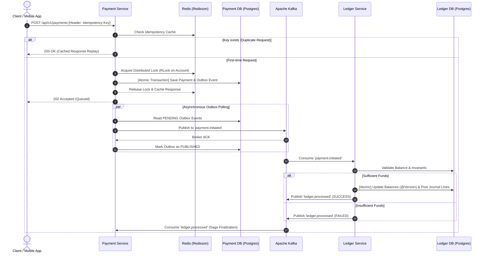

# Distributed Event-Driven Payment & Double-Entry Ledger Platform

[](https://openjdk.org/)
[](https://spring.io/projects/spring-boot)
[](https://kafka.apache.org/)
[](https://redis.io/)
[](https://www.postgresql.org/)
[](https://www.docker.com/)
[](https://kubernetes.io/)
[](https://www.terraform.io/)

An enterprise-grade, distributed microservices platform engineered to handle high-throughput financial payment workflows with **zero message loss**, **strict idempotency**, and **immutable double-entry ledger bookkeeping**.

Built with **Spring Boot 3**, **Apache Kafka**, **PostgreSQL**, **Redis (Redisson)**, and **Resilience4j**.

---

## 🏛️ System Architecture



---

## 🎯 Core Architectural Problems Solved

### 1. Zero Message Loss (Transactional Outbox Pattern)
* **Problem**: In distributed systems, publishing an event to a message broker (Kafka) and saving state to a database (PostgreSQL) cannot participate in a single 2-Phase Commit without massive latency penalties. If the broker is unreachable after database commit, the event is permanently lost.
* **Solution**: The `PaymentService` saves the payment record and the outbound event payload into the `outbox_events` table inside the **same local ACID database transaction**. A resilient background publisher daemon reads pending events, emits them to Kafka, and marks them `PUBLISHED` only after receiving broker acknowledgement.

### 2. Strict Idempotency & Concurrency Control
* **Problem**: Network timeouts, retries, or users rapidly double-tapping "Pay" can cause duplicate debits and race conditions.
* **Solution**:
  - Every write request requires a unique `Idempotency-Key` HTTP header.
  - Completed responses are stored in **Redis with a 24-hour TTL**. If a duplicate request arrives, the cached response is replayed instantly with zero database load.
  - **Redisson Distributed Locks (`RLock`)**: When concurrent requests target the same source account, a distributed lock serializes processing, preventing negative account balances and race conditions.

### 3. Immutable Double-Entry General Ledger
* **Problem**: Standard eCommerce systems simply mutate a balance column (`balance = balance - X`), which violates financial accounting rules and provides zero auditability.
* **Solution**:
  - The `LedgerService` enforces strict double-entry bookkeeping: every transaction consists of balanced **Debit** and **Credit** journal lines.
  - **Mathematical Invariant**: $\sum \text{Debits} == \sum \text{Credits}$ at all times.
  - Journal lines are **append-only and immutable** (no `UPDATE` or `DELETE`).
  - Account balances use JPA `@Version` optimistic locking to reject stale updates.

### 4. Fault Tolerance & Dead Letter Queues (DLQ)
* **Problem**: Corrupted messages or unhandled business exceptions can cause Kafka consumer threads to loop indefinitely (poison pill).
* **Solution**:
  - Configured Spring Kafka `DeadLetterPublishingRecoverer` with `DefaultErrorHandler`.
  - Retries failed message processing with backoff (2 retries). If failures persist, the message is routed to `payment.initiated.DLT` for manual inspection and alerting without blocking downstream processing.
  - **Resilience4j Circuit Breaker**: External banking integrations (acquirers) are wrapped with circuit breakers and fallback handlers.

---

## 🚀 Quickstart & Local Setup

### Prerequisites
- **Docker & Docker Compose** (version 20.10+)
- **Java 17 or 21** (Optional if running entirely via Docker)

### 1. Clone & Start Infrastructure
```bash
git clone https://github.com/Debayanmondal/payment-ledger-platform.git
cd payment-ledger-platform

# Launch PostgreSQL, Redis, Kafka (KRaft), Kafka UI, and Prometheus
docker compose up -d
```

### 2. Verify Services Health
- **Kafka UI**: [http://localhost:8085](http://localhost:8085)
- **Prometheus**: [http://localhost:9090](http://localhost:9090)
- **Payment Service Actuator**: [http://localhost:8081/actuator/health](http://localhost:8081/actuator/health)
- **Ledger Service Actuator**: [http://localhost:8082/actuator/health](http://localhost:8082/actuator/health)

---

## 🧪 Live Demonstration & API Testing

You can run the automated verification script:
```powershell
# On Windows (PowerShell):
.\scripts\demo-test.ps1

# On Linux / macOS (Bash):
chmod +x ./scripts/demo-test.sh
./scripts/demo-test.sh
```

Or execute manual step-by-step `curl` requests:

### Step 1: Initialize Test Accounts
```bash
curl -X POST http://localhost:8082/api/v1/ledger/seed
```
*Seeds `ACC-1001` (Alice - \$10,000.00) and `ACC-2002` (Bob - \$2,500.00).*

### Step 2: Execute Idempotent Payment
```bash
curl -X POST http://localhost:8081/api/v1/payments \
  -H "Content-Type: application/json" \
  -H "Idempotency-Key: TXN-DEMO-001" \
  -d '{
    "sourceAccountId": "ACC-1001",
    "destinationAccountId": "ACC-2002",
    "amount": 500.00,
    "currency": "USD",
    "description": "Monthly consultant retainer"
  }'
```
**Response (202 Accepted):**
```json
{
  "success": true,
  "message": "Payment accepted and queued for ledger processing",
  "data": {
    "paymentId": "7d6438ee-2f78-4eb1-997a-e4905187ca81",
    "idempotencyKey": "TXN-DEMO-001",
    "sourceAccountId": "ACC-1001",
    "destinationAccountId": "ACC-2002",
    "amount": 500.00,
    "currency": "USD",
    "status": "PENDING",
    "idempotentReplay": false
  }
}
```

### Step 3: Test Idempotency Interception (Replay Same Key)
Re-execute the exact command above. Notice:
- Status: **200 OK** (instant cache return)
- `idempotentReplay`: **true**
- No duplicate ledger debit occurs!

### Step 4: Inspect Double-Entry Audit Trail
```bash
curl http://localhost:8082/api/v1/ledger/entries/7d6438ee-2f78-4eb1-997a-e4905187ca81
```
**Response:**
```json
{
  "id": 1,
  "referenceId": "7d6438ee-2f78-4eb1-997a-e4905187ca81",
  "description": "Payment transfer from ACC-1001 to ACC-2002",
  "totalAmount": 500.0000,
  "currency": "USD",
  "lines": [
    { "accountId": "ACC-1001", "entryType": "DEBIT", "amount": 500.0000 },
    { "accountId": "ACC-2002", "entryType": "CREDIT", "amount": 500.0000 }
  ]
}
```

### Step 5: Test Resilience4j Circuit Breaker
```bash
# Normal Call:
curl "http://localhost:8081/api/v1/payments/test-circuit-breaker?simulateFailure=false"

# Simulated Downstream Failure (Triggers Fallback):
curl "http://localhost:8081/api/v1/payments/test-circuit-breaker?simulateFailure=true"
```

---

## ☁️ Cloud & Infrastructure (AWS EKS, RDS, Terraform)

This repository includes production-ready Infrastructure as Code:
- **`terraform/main.tf`**: Provisions Amazon VPC, Amazon RDS PostgreSQL multi-AZ, Amazon ElastiCache Redis, and Amazon EKS Cluster.
- **`k8s/`**: Kubernetes manifests for Deployments, ClusterIP Services, Health Probes (Liveness & Readiness), and Resource Limits.

---


## 👨‍💻 Author
**Debayan Mondal**  
*Java Backend Developer | Spring Boot | AWS Cloud*  
- LinkedIn: [Debayan Mondal](https://www.linkedin.com/)  
- GitHub: [@Debayanmondal](https://github.com/Debayanmondal)
